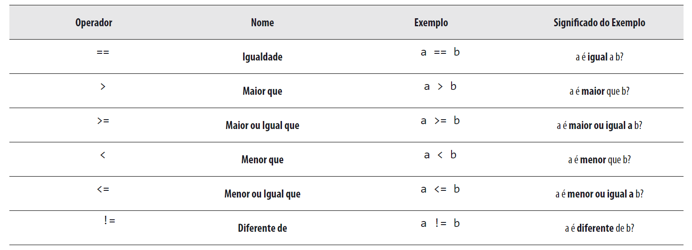

## :banana: Capítulo 3
#  Testes E Condições

- ## Valores Lógicos — Verdadeiro e Falso
    -**Em C não existe nenhum tipo específico de dados para armazenar valores lógicos. Em C o valor lógico FALSO é representado por 0 (ZERO). Tudo aquilo que seja diferente de 0 (ZERO) representa o valor lógico VERDADEIRO.**

- ## Operadores Relacionais
  - Em C existe um conjunto de seis operadores relacionais, os quais podem ser usados na avaliação de expressões. Seu objetivo consiste no estabelecimento de relações entre os operandos.

    

    **Uma expressão que contenha um operador relacional devolve sempre como resultado o valor lógico VERDADE (1) ou FALSO (0).**

    ***Um erro muito freqüente em programação é a troca do operador == pelo operador =. O operador == verifica se duas expressões são iguais, enquanto o operador = é utilizado para a atribuição de valores a variáveis.***

- ## if-else
  - A instrução if-else é uma das instruções de controle de fluxo da linguagem C. Permite indicar quais as circunstâncias em que se deve executar determinada instrução ou conjunto de instruções.
  
  - A instrução if-else funciona da seguinte maneira:

      - A condição é avaliada;

      - Se o resultado da condição for verdadeiro, executa a instrução1;

      - Se o resultado da condição for falso, executa a instrução2 (caso exista o else).

      ```C
        #include <stdio.h>

        main(){
          int x;
          printf("Insira um Num: ");
          scanf("%d", &x);
          if (x >= 0)
            print("Numero Positivo\n");
          else
            print("Numero Negativo\n");
        }
      ```
- ## Bloco de Instrucoes
Um Bloco é um conjunto de duas ou mais intruções delimitadas por chaves.

Um Bloco pode ser colocado sem problemas num programa, no local em que possa estar uma intrução simples. 

! Depois de um Bloco não é necessário colocar ponto-e-vírgula(;).

```C
#include <stdio.h>

main() {
  int x, y, tmp;
  printf("Introduza dois num: ");
  scanf("%d %d", &x, &y);

  if (x > y) {
    tmp = x;
    x = y;
    y = tmp;
  }
  printf("%d %d", x, y);
}
```
Repare que caso o valor de x seja maior que o valor de y é necessário trocar os valores de x e y de forma que x tenha sempre o menor dos valores, evitando assim invocar duas vezes a função printf para cada uma das situcações.

- ## Intruções if-else Encadeadas 
Exitem situações em que o teste de uma condição não é suficiente para tomar uma decisão. Pode ser necessário testar mais do que uma condição.

Exemplo. Um programa que solicite um salário ao utilizador e mostre o imposto a pagar.
- Se o salário for negativo ou zero mostre o erro respectivo. 
- Se o salário for maior que 1000, paga 10% de imposto, se não paga apenas 5%.

```C
  #include <stdio.h>

  main() {
    float salario, imposto;

    printf("Informe o seu salario: ");
    scanf("%f", &salario);

    if(salario <= 0) {
      printf("Salario Invalido");
      return ;
    } else if (salario <= 1000){
      imposto = salario * 0.05;
    } else {
      imposto = salario * 0.1;
    }

    printf("O valor do seu imposto e de: %.2f \n", imposto);
  }
```
Operadores Lógicos
