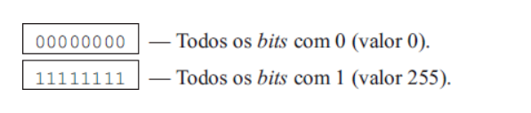
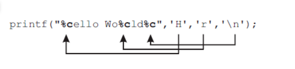
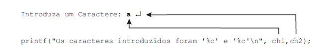

<h3 align="center">
  Linguagem C
</h3>

<p align="center">“Se você quiser fazer uma torta de maçã do nada, primeiro tem que inventar o universo”!</blockquote>

<p align="center">
  

  

  <a href="https://github.com/fdAssis/Linguagem_C/stargazers">
    
  </a>
</p>

<p align="center">
  <a href="#pushpin-sobre-o-repositorio">Sobre esse repositorio </a>&nbsp;&nbsp;&nbsp;|&nbsp;&nbsp;&nbsp;
  <a href="#memo-licença">Licença</a>
</p>

## :pushpin: Sobre o repositorio
  Este repositorio tem como objetivo apresentar as características de uma verdadeira linguagem de programação - a Linguagem C, além das dicas e truques usados pelos programadores, através de múltiplos exemplos. 

## :tomato: Capítulo 1
#  Primeiros conceitos de C
- Em C, um programa começa com a função **main()**.
```c
void main() {

}
```
- O código a executar é colocado entre **{ }**.
- Um **Bloco** é formado por qualquer conjunto de intruções entre { }.
```c
// Bloco 1
void bloco1() {

}

// Bloco 2
void bloco2() {

}
```
- Cada intrução deve ser seguida de um ponto-e-vírgula **( ; )**.
```c
...
printf("A tecnologia para tornar algo invisível é tão infinitamente complexa que, é muito mais simples e eficaz remover a coisa e esquecer o assunto.");

system("pause");
...
```
- A "arrumação" do código é arbitrária e depende das preferências de cada programador.

- C faz distinção entre minúsculas e maiúsculas - **Case Sensitive** -.

- As *string*s em C são delimitadas pelo caractere aspas **"**.

- Para escrever uma mensagem na tela usa-se a função **printf()**.
```c
void main() {
  printf("Acho mais importante estar feliz do que estar certo");

}
```
- A funções **printf** não faz parte da lingugem C. Pertence à sua extensa biblioteca de funções. Para termos acesso a esta e a outras funções de entrada/saída devemos incluir nos nossos programas o arquivo **stdio.h**.
```c
#include <stdio.h>

void main(){
  printf("Por que as pessoas nascem? por que elas morrem? por que elas passam um tempo tao grande entre o nascimento e a morte usando relogios digitais"); 

}
```
- As linhas começadas por **#** ( **#include, #define, etc.** ) não são C, mas sim diretivas ao pré-processador. Por isso não devem ser seguidas de ponto-e-vírgula.

- A representação de caracteres especias ou de caracteres que, de outra forma, seriam dificeis de representar faz-se através de um conjunto de dois ou mais caracteres, sendo em geral o primeiro caractere a barra invertida ( **\ - Backslash** ).
```c
...
// Forma de escrever uma string em que as aspas sejam um caractere não delimitador 
printf(" \"Amor:"\ muito dolososo. Evite, se possivel");
...
```
***A lista completa dos caracteres que podem ter que ser representados, precedidos do caractere especial *\\* é:***

| Comando | Descrição |
| --- | --- |
| \7 | Bell (sinal sonoro do computador) |
| \a | Bell (sinal sonoro do computador) |
| \b | BackSpace|
| \n | New Line (mudança de linha)|
| \r | Carriagem Return|
| \t | Tabulação Horizontal |
| \v | Tabulação Vertical |
| \\\ | Caractere \ (forma de representar o próprio caractere especial \\)
| \\\' | Caractere ' (aspas simples)|
| \\\" | Caractere " (aspas)|
| \\\? | Caractere ? (ponto de interrogação)|
| \000 | Caractere cujo código ASCII em Octal é 000|
| \Xnn | Caractere cujo código ASCII em Hexadecimal é nn|
| %% | Caractere %|

- Os **comentários** são escritos entre **- /*** e ***/ -** para comentar blocos ou **//** para comentar somente uma linha e são ignorados pelo compilador (a menos que se encontrem dentro de *string* ).
***Não pode existir comentários dentro de comentários***
```c
void main() {
  /* inicio do comentario 1
    // printf("42\n"); 
  */
}
```
## :grapes: Capítulo 2
#  Tipos de Dados Básicos

- **Variáveis**: Uma variável é nada mais que um nome que damos a uma determinada posição de memória para conter um valor de um determinado tipo. O valor contido em uma variável pode variar ao longo da execução de um programa. **Uma variável deve ser sempre definida antes de ser usada.**
```c
...
int i; // i é uma variável do tipo inteiro
char ch1, novo_char; // ch1 e novo_char sao vars do tipo char
float resultado, divisao; // [...]
double total; // [...]
...
```
- **Declaração de variáveis tem que ser sempre realizada antes de sua utilização e antes de qualquer intrução**
```c
void main(){
  Declaração de Variáveis

  Intrução1;
  Intrução1;
  ...
}
```
 - Quando são escritas várias atribuições consecutivas, estas são realizadas não da esquerda para a direita, mas sim da direita para a esquerda.

    - a = b = c = d = 5; 

    - **1.** Como se trata de atribuições, estas são realizadas da direita para a esquerda.

    - **2.** A primeira a ser realizada é d = 5.

    - **3.** Como foi referido anteriormente, o valor atribuído a d é devolvido como resultado da atribuição:

    - **4.** O valor devolvido (5) é então atribuído a c.

    - **5.** Como é uma atribuição, devolve o valor atribuído (5) que é colocado em b e em a pelo mesmo processo.

    - **6.** A atribuição do valor 5 à variável a devolve também um valor, mas que não é aproveitado.


  - ## **Tipos de dados**
      ### **Inteiros** - ***int***
      
      - As variáveis declaradas do tipo inteiro são utilizadas para armazenar valores que pertencem ao conjunto dos números naturais positivos e negativos. **Ex: 2, -42, +232, 0**.

      **Operações sobre Inteiros**

      | Operação | Descrição | Exemplo | Resultado |
      | --- | --- | ---| --- |
      | + | Soma | 40 + 2 | 42|
      | - | Subtração | 44 - 4 | 42|
      | * | Multiplicação | 7 * 6 | 42|
      | / | Divisão Inteira | 42 / 1 | 42|
      | % | Resto da Divisão Inteira (**Módulo**) | 42 % 2020 | 42|
      

      ***Qualquer operação entre inteiros(int) retorna um inteiro.***
      ```c
      #include <stdio.h>

      void main() {
         int numero = 321;

         printf("O valor de numero = %d e o valor seguinte = %d\n", numero, numero+1);
         //..."O valor de numero = <inteiro> e o valor seguinte = <inteiro>

         /*
          <inteiro> representa o valor inteiro que está guardado numa variável, constante ou é o resultado de qualquer expressão.

          O formato de escrita de um Inteiro na função printf é %d.
          O primeiro %d será substituido pelo valor da variável 'numero' e o %d seguinte será substituido pelo resultado da soma de 'numero+1'.
         */
      }
      ```
      
      - Da mesma forma que existe a função printf para a escrita de valores, existe uma função correspondente para a leitura de valores — a função scanf.
      
      ```C
      #include<stdio.h>

      main(){
        int numero;
        
        printf("Introduza um numero: ");
        scanf("%d, &numero");

        printf("O Numero digitado foi: %d\n", numero);
      }

      ```
      ***A função scanf (leitura formatada) funciona de forma semelhante à função printf. Uma vez que ela foi implementada para a leitura de valores, a string inicial deve conter apenas o formato das variáveis que queremos ler. Depois de especificados os formatos de leitura na string, devem ser colocadas todas as variáveis correspondentes pela ordem em que ocorrem os formatos, precedidas de um &.***

      ## **Inteiros e Variações**
      - O tamanho em bytes de um inteiro varia de arquitetura para arquitetura, sendo os valores mais habituais de 2 ou 4 bytes.

        Para saber qual a dimensão de um inteiro (ou de qualquer tipo ou variável), o C disponibiliza um operador denominado sizeof, cuja sintaxe é semelhante à utilizada para invocar uma função.

        - **sizeof <expressão> ou sizeof ( \<tipo> )**

        ```C
        #include <stdio.h>

        main(){
          printf("O tamanho em bytes de um Inteiro = %d\n", sizeof(int));
        }
        ```
        Na declaração de um inteiro podem ser utilizados quatro prefixos distintos para melhor definição das características da variável.

        **•short** — Inteiro pequeno (2 bytes)

        **•long** — Inteiro grande (4 bytes)

        **•signed** — Inteiro com sinal (numeros negativos e positivos)

        **•unsigned** — Inteiro sem sinal (apenas numeros positivos)

        ### **short e long**

        - Para garantirmos que o inteiro n usa apenas 2 bytes de memória, independentemente da arquitetura utilizada, devemos declarar a variável como:

          **short int n; ( ou short n; )**

        - Para garantirmos que o inteiro n usa sempre 4 bytes de memória, independentemente da arquitetura utilizada, devemos declarar a variável como:

          **long int n; ( ou long n; )** 
        
        **O formato de leitura e escrita de variáveis inteiras short e long nas funções scanf e printf deve ser precedido dos prefixos h (short) e l (long).**

        ```C
        #include<stdio.h>

        main(){
          short int idade;
          int montante;
          long int num_conta;

          printf("Qual sua idade: ");
          scanf("%hd", &idade);

          printf("Qual o montante a depositar: ");
          scanf("%d", &montante);

          printf("Qual o numero da conta: ");
          scanf("%ld", &num_conta);

          printf("Uma pessoa de %hd anos depositou R$%d na sua conta %ld\n", idade, montante, num_conta);
        }
        ```

        ## **signed e unsigned**
        
        - Se deseja que a variável contenha apenas valores positivos, deverá ser declarada com o prefixo unsigned.
        
          **unsigned int idade;**
        
        - O prefixo signed, antes de um inteiro, não é necessário, pois por padrão todos os inteiros quando são criados são sinalizados (signed).

        **Ao trabalhar com valores sem sinal, o conjunto de valores com que podemos trabalhar no lado positivo é ampliado.**

        **O formato de leitura e escrita de variáveis inteiras sem sinal (unsigned int), utilizando as funções scanf e printf, é %u em vez de %d.**

       

      ## **Reais — float e double**
      - As variáveis declaradas do tipo float ou double são utilizadas para armazenar valores numéricos com parte fracionária. São também freqüentemente denominadas reais ou de ponto flutuante (Ex: 3.14, 0.0000024514, 1.0).

        A diferença entre uma variável do tipo float e uma outra do tipo double é o número de bytes que reserva para armazenar o valor. A dimensão do float é normalmente de quatro bytes, enquanto a do double é de oito bytes.

        ```C
          #include<stdio.h>

          main(){
            float raio, perimetro;
            double Pi = 3.1415927, area;

            printf("Introduza o Raio da Circunferencia: ")
            scanf("%f", &raio);
            area = Pi * raio * raio;
            perimetro = 2 * Pi * raio;

            printf("Area = %f\n Perimetro = %f\n", area, perimetro);
          }
        ```
        **O formato de leitura e escrita para números reais é %f.**

      - A atribuição, a leitura e a escrita de números reais podem ser realizadas usando a notação científica, especificando uma base e um expoente.

        ```C
          #include<stdio.h>
          
          main(){
            float quilos = 1.0E3;
            double gramas = 1.0e6;

            float num_toneladas;

            printf("Quantas toneladas comprou: ");
            scanf("%f", &num_toneladas);

            printf("Numero de quilos = %f = %e\n", num_toneladas * quilos, num_toneladas * quilos);
            printf("Numero de gramas = %f = %E\n", num_toneladas * gramas, num_toneladas * gramas);
          }
        ```
        **Os valores, quando são armazenados em números de ponto flutuante, podem comportar algum erro mínimo, resultante de arredondamentos ou do formato interno de representação do mesmo.**

        **Operações sobre Reais**

        | Operação | Descrição | Exemplo | Resultado |
        | --- | --- | ---| --- |
        | + | Soma | 21.3 + 4.1 | 25.4|
        | - | Subtração | 21.7 - 4.8 | 16.9|
        | * | Multiplicação | 21.2 * 4.7 | 99.64|
        | / | Divisão Real | 21.0 / 4.0 | 5.25 |
        | % | Não faz sentido aplicar a reais | n.a. | n.a.|

        **Qualquer operação em que pelo menos um dos operandos seja real produz um resultado do tipo real. Se algum dos operandos for, por exemplo, inteiro e um outro real, o inteiro é alterado para o tipo real (4 -> 4.0), para que se possa realizar a operação entre dois reais.**

      ## **Caracteres — char**
      - O tipo char permite armazenar **UM ÚNICO CARACTERE** numa variável desse tipo.

         **char, independentemente da arquitetura utilizada, sempre se armazena num único byte.**
        
        Assim, o número de caracteres possíveis de representar é 256, pois é o número de combinações possíveis de representar num único byte (0…255).

        

        **Para realizar uma carga automática de uma variável do tipo char deverá ser colocado o caractere a atribuir entre Aspas simples (Ex: 'A'), e não entre Aspas.**

        ```C
          #include <stdio.h>

          main() {
            printf("%cellWo%cld%c", 'H', 'r', '\n');
          }
        ```
        

        A leitura de caracteres pode ser realizada sem ter que se recorrer à função scanf. Pode-se utilizar uma outra função desenhada unicamente para a leitura de um caractere — a função getchar(). Ela lê um caractere e devolve o caractere obtido como resultado da função, evitando a escrita de parâmetros, formatos, &ch etc.

        **caractere lido <-  getchar();**

        ```C
          #include <stdio.h>

          main(){
            char ch;
            
            printf("Introduza um Caractere: ");
            ch = getchar();

            printf("O caractere introduzido foi '%c' \n" ch);
          }
        ```

        **getchar() vs. scanf()**
        - A função getchar evita a presença do formato de leitura (%c), pois o scanf é uma função genérica de leitura, enquanto o getchar é uma função especificamente dedicada à leitura de caracteres.

        ***O tratamento de caracteres pode, no entanto, apresentar algumas surpresas. Observe com atenção o seguinte exemplo.***

        ```C
          #include <stdio.h>

          char ch1, ch2;

          main() {
            
            printf("Introduza um caractere: ");
            scanf("%c", &ch1);

            printf("Introduza outro caractere: ");
            scanf("%c", &ch2);

            printf("Os caracteres introduzido foram '%c' e '%c'\n, ch1, ch2);
          }
        ```
        **A leitura de valores através da maioria das funções usa o **buffer** do teclado como repositório temporário dos caracteres que nós escrevemos. Se não estivéssemos usando o buffer do teclado, assim que batêssemos numa tecla o caractere seria automaticamente colocado na variável sem necessitar que fosse pressionada a tecla ENTER. Desse modo, quando solicitamos o primeiro caractere somos obrigados a escrever o caractere e teclar em ENTER. Assim, enviamos ao programa não um, mas dois caracteres.**

        

        ***A solução é particularmente simples, e consiste em colocar um espaço em branco '□' imediatamente antes do %c do segundo scanf, mas dentro da string do formato.***

        ```C
          #include <stdio.h>

          char ch1, ch2;

          main() {
            
            printf("Introduza um caractere: ");
            scanf("%c", &ch1);

            printf("Introduza outro caractere: ");
            scanf(" %c", &ch2);

            printf("Os caracteres introduzido foram '%c' e '%c'\n, ch1, ch2);
          }
        ```
        **O espaço em branco dentro de um scanf pede a essa função para ler e ignorar todos os Espaços em Branco, New Lines e Tabs que encontrar.**

        ***Uma outra forma de resolver o problema consiste em limpar todos os caracteres que existam no buffer do teclado utilizando a função fflush(stdin);***


## :memo: Licença

Esse projeto está sob a licença MIT.

---